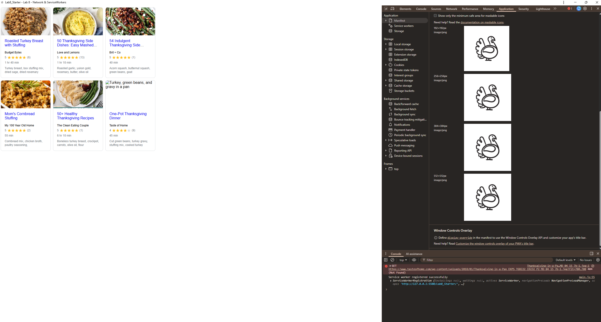

# Lab8-Starter

## Authors
- Lorenzo Lemus

## Deployed Site
https://lorenz0l.github.io/Lab8_Starter/

## Graceful Degradation and Service Workers
When you first visit the site, the service worker saves all the files and data to a local cache.When you first visit the site, the service worker saves all the files and data to a local cache. If you lose your internet connection later, instead of the app completely breaking, the service worker serves everything from that cache so the page still loads. This is graceful degradation because the app loses some functionality like getting fresh data, but it still works instead of failing completely.

